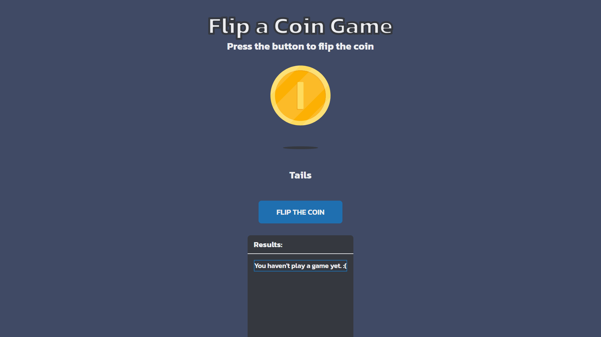
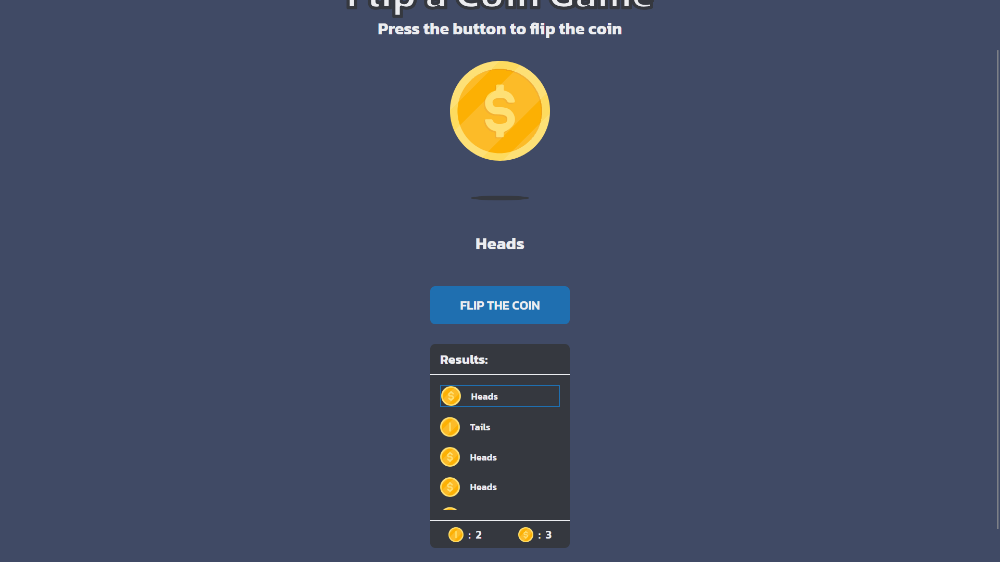

<h1 align="center">Flip the coin game | devChallenges</h1>

   Solution for a challenge <a href="https://devchallenges.io/challenge/flip-the-coin" target="_blank">Flip The Coin</a> from <a href="http://devchallenges.io" target="_blank">devChallenges.io</a>.

  <h3>
    <a href="https://heroic-kataifi-8ce074.netlify.app/">
      Demo
    </a>
     | 
    <a href="https://github.com/jevaldev/devchallenges/tree/master/flip-the-coin-master">
      Solution
    </a>
     | 
    <a href="https://devchallenges.io/challenge/flip-the-coin">
      Challenge
    </a>
  </h3>

<!-- TABLE OF CONTENTS -->

## Table of Contents

- [Overview](#overview)
  - [What I learned](#what-i-learned)
- [Built with](#built-with)
- [Features](#features)
- [Contact](#contact)
- [Acknowledgements](#acknowledgements)

<!-- OVERVIEW -->

## Overview

This project was developed as part of a [DevChallenges](https://devchallenges.io/challenges-dashboard) exercise.  
My approach for this challenge included adding a dynamic results table that displays each play and maintains a total score count for Heads and Tails.

### What I learned

This challenge helped me refresh several core vanilla JavaScript concepts I hadn't used much lately, since most of my recent work has involved frameworks. Key takeaways include:

- Revisiting `getElementById`, `appendChild`, and `createElement`.
- Using `insertBefore()` to dynamically insert a node as the first child within a specified parent element.
- Managing class-based visibility toggles for better UI control.

### Built with

<!-- This section should list any major frameworks that you built your project using. Here are a few examples.-->

- Semantic HTML5 markup
- **CSS** custom properties
- **Flexbox**
- Vanilla **JavaScript**

## Features

<!-- List the features of your application or follow the template. Don't share the figma file here :) -->

- Coin flip simulation
- Displays result images and labels (Heads or Tails)
- Running history of results with most recent at the top
- Simple, responsive layout

## Acknowledgements

<!-- This section should list any articles or add-ons/plugins that helps you to complete the project. This is optional but it will help you in the future. For exmpale -->

- [MDN Web Docs — Node: insertBefore()](https://developer.mozilla.org/en-US/docs/Web/API/Node/insertBefore)

## Author

- LinkedIn [Jesus Valdés Viramontes](www.linkedin.com/in/jesus-valdes-viramontes)
- GitHub [jevaldev](https://github.com/jevaldev)
